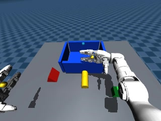
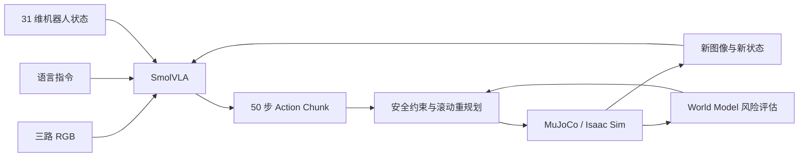

# Unitree G1 语言驱动双臂抓取与 World Model

<p align="center">
  <strong>多视角视觉 · 语言目标理解 · SmolVLA 动作生成 · 闭环抓取 · Sim2Sim</strong>
</p>

<p align="center">
  
  
  
  
  
</p>

<p align="center">
  
</p>

面向仓储分拣搬运场景，构建从自然语言指令到 G1 双臂动作执行的完整闭环：机器人读取头部与双腕三路 RGB 图像、语言指令和上半身状态，由 VLA（Vision-Language-Action，视觉-语言-动作模型）生成动作块，经安全约束和滚动重规划后完成目标选择、接近、抓取、抬升与放置。

## 项目亮点

| 模块 | 完成内容 |
| --- | --- |
| 多模态输入 | 头部 + 双腕三路 RGB、自然语言指令、31 维腰臂手状态 |
| 双臂操作 | 面向红色三角体、黄色杆、绿色方块的目标选择与双臂协同操作 |
| 闭环执行 | Action Chunk 滚动执行、状态反馈、失败轨迹分析与 Recovery/DAgger 数据聚合 |
| 物理验证 | 43-DoF 资产适配、接触/碰撞/限位检查、MuJoCo → Isaac Sim 的 Sim2Sim 链路 |
| World Model | 预测接触、掉落、碰撞与关节风险，为 VLA 候选动作提供短时滚动评分 |

## 系统架构



## 核心成果

- 建立三路视觉、语言、31 维状态/动作对齐的 LeRobot 数据合同，完成数据采集、转换、微调和留出集评估链路。
- 冻结视觉语言主干并微调约 9990 万个动作相关参数；训练损失由 `2.6847` 降至 `0.1251`，留出集动作误差相对基础模型下降 `56.6%～61.3%`。
- 通过 Action Chunk 重规划与 DAgger 式数据聚合，补充策略真实失败状态下的恢复样本，覆盖减速、重新抬升和稳定持物阶段。
- 完成 MuJoCo 到 Isaac Sim 的 43-DoF 资产及 31 维动作映射，150 帧 / 10 s 回放关节跟踪 RMSE 为 `0.099 rad`。

## 代码导航

| 路径 | 说明 |
| --- | --- |
| `scripts/run_g1_language_pick_place.py` | 语言条件双臂抓取与放置主流程 |
| `scripts/validate_g1_bimanual_actuation.py` | 关节映射、接触、限位与执行器检查 |
| `scripts/g1_language_action_adapter.py` | 语言、状态与动作空间适配 |
| `scripts/collect_g1_language_pick_place_dataset.py` | 多视角专家数据采集 |
| `scripts/evaluate_g1_language_pick_place.py` | 闭环任务评估与结果汇总 |
| `scripts/g1_finger_contact_geometry.py` | 手指接触几何与抓取配置 |

## 快速开始

```bash
python3 -m pip install -r requirements.txt

python scripts/run_g1_language_pick_place.py \
  --asset /path/to/g1_scene.xml \
  --target-object yellow_rod \
  --output-dir /tmp/g1-language-demo
```

可选目标：`red_triangle`、`yellow_rod`、`green_cube`。

```bash
python scripts/validate_g1_bimanual_actuation.py --help
python scripts/collect_g1_language_pick_place_dataset.py --help
python scripts/evaluate_g1_language_pick_place.py --help
```

## 数据与模型

公开仓库保留核心代码、接口合同和轻量演示素材。受体积、设备资产与部署安全限制，完整数据集、模型权重、私有机器人资产和训练日志未上传；运行时可通过命令行传入本地资产与输出目录。

## 关键词

`Embodied AI` · `VLA` · `SmolVLA` · `LeRobot` · `Bimanual Manipulation` · `World Model` · `MuJoCo` · `Isaac Sim` · `Sim2Sim`
